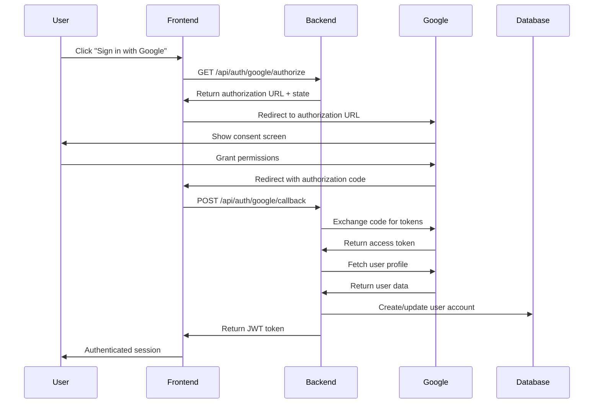

# Design Document: Google OAuth Authentication

## Overview

This design document outlines the implementation of Google OAuth 2.0 authentication for the music/DJ set tracking application. The feature will integrate seamlessly with the existing authentication system, following the same patterns established by the SoundCloud OAuth implementation.

The implementation uses the OAuth 2.0 Authorization Code flow with PKCE (Proof Key for Code Exchange) for enhanced security. Users will be able to sign in with their Google accounts, with automatic account creation or linking based on email addresses.

## Architecture

### High-Level Flow



### Component Integration

The Google OAuth implementation will integrate with existing components:

- **Backend API**: New endpoints in `app/api/auth.py`
- **OAuth Service**: New service module `app/services/google_oauth.py`
- **User Model**: Extend existing model with Google-specific fields
- **Frontend Store**: Extend `authStore.js` with Google authentication methods
- **UI Components**: Add Google sign-in button to existing login forms

## Components and Interfaces

### Backend Components

#### 1. Google OAuth Service (`app/services/google_oauth.py`)

```python
class GoogleOAuthService:
    def get_authorization_url(state: str) -> str
    async def exchange_code_for_token(code: str) -> Optional[Dict]
    async def get_user_info(access_token: str) -> Optional[Dict]
    async def refresh_token(refresh_token: str) -> Optional[Dict]
```

**Key Functions:**
- **get_authorization_url()**: Generates Google OAuth authorization URL with required scopes
- **exchange_code_for_token()**: Exchanges authorization code for access/refresh tokens
- **get_user_info()**: Fetches user profile data from Google's userinfo endpoint
- **refresh_token()**: Refreshes expired access tokens using refresh tokens

**OAuth Configuration:**
- **Authorization Endpoint**: `https://accounts.google.com/o/oauth2/v2/auth`
- **Token Endpoint**: `https://oauth2.googleapis.com/token`
- **User Info Endpoint**: `https://www.googleapis.com/oauth2/v2/userinfo`
- **Scopes**: `openid email profile` for basic user information

#### 2. Authentication API Endpoints (`app/api/auth.py`)

```python
@router.get("/google/authorize")
async def google_authorize() -> Dict[str, str]

@router.post("/google/callback", response_model=Token)
async def google_callback(code: str, state: str, db: AsyncSession) -> Token
```

**Endpoint Specifications:**
- **GET /api/auth/google/authorize**: Returns authorization URL and state parameter
- **POST /api/auth/google/callback**: Processes OAuth callback and returns JWT token

#### 3. Database Schema Extensions

```sql
-- Add Google OAuth fields to users table
ALTER TABLE users ADD COLUMN google_user_id VARCHAR(255) UNIQUE;
ALTER TABLE users ADD COLUMN google_access_token TEXT;
ALTER TABLE users ADD COLUMN google_refresh_token TEXT;
ALTER TABLE users ADD COLUMN google_token_expires_at TIMESTAMP;

-- Create index for Google user ID lookups
CREATE INDEX idx_users_google_user_id ON users(google_user_id);
```

### Frontend Components

#### 1. Authentication Store Extensions (`authStore.js`)

```javascript
const useAuthStore = create((set, get) => ({
  // New Google OAuth methods
  loginWithGoogle: async () => Promise<{success: boolean, error?: string}>
  handleGoogleCallback: async (code: string, state: string) => Promise<{success: boolean, error?: string}>
}));
```

#### 2. Google Sign-In Button Component

```jsx
const GoogleSignInButton = ({ onSuccess, onError, disabled }) => {
  // Renders Google-branded sign-in button
  // Handles click events and loading states
  // Follows Google's branding guidelines
}
```

#### 3. OAuth Callback Page (`GoogleCallbackPage.jsx`)

```jsx
const GoogleCallbackPage = () => {
  // Handles OAuth callback from Google
  // Extracts code and state from URL parameters
  // Calls authentication store to complete login
  // Redirects to intended destination or dashboard
}
```

## Data Models

### User Model Extensions

The existing `User` model will be extended with Google OAuth fields:

```python
class User(Base):
    # Existing fields...
    
    # Google OAuth fields
    google_user_id: Mapped[Optional[str]] = mapped_column(String(255), unique=True, index=True, nullable=True)
    google_access_token: Mapped[Optional[str]] = mapped_column(Text, nullable=True)
    google_refresh_token: Mapped[Optional[str]] = mapped_column(Text, nullable=True)
    google_token_expires_at: Mapped[Optional[datetime]] = mapped_column(DateTime, nullable=True)
```

### User Account Linking Strategy

**Account Creation Logic:**
1. **New Google User**: Create new account with Google profile data
2. **Existing Email Match**: Link Google credentials to existing account
3. **Existing Google ID**: Authenticate existing Google-linked account

**Profile Data Mapping:**
- `google_user_id` ← Google `sub` field (unique identifier)
- `email` ← Google `email` field
- `display_name` ← Google `name` field (if not already set)
- `avatar_url` ← Google `picture` field (if not already set)
- `username` ← Generated from Google `email` or `name`

## Correctness Properties

*A property is a characteristic or behavior that should hold true across all valid executions of a system-essentially, a formal statement about what the system should do. Properties serve as the bridge between human-readable specifications and machine-verifiable correctness guarantees.*

Based on the prework analysis and property reflection, the following properties ensure the correctness of the Google OAuth implementation:

**Property 1: Complete OAuth Flow**
*For any* user initiating Google OAuth, the system must generate a unique state parameter, redirect to Google's authorization page, receive the callback with matching state, exchange the authorization code for tokens, and issue a JWT access token.
**Validates: Requirements 1.1, 1.2, 1.3, 1.4, 1.5, 3.1, 3.2**

**Property 2: Account Creation and Linking**
*For any* successful Google authentication, if no matching Google user ID exists but the email matches an existing account, the Google credentials must be linked to the existing account preserving all data; otherwise a new account must be created with Google profile data.
**Validates: Requirements 2.1, 2.2, 2.3, 2.4, 2.5**

**Property 3: State Parameter Security**
*For any* OAuth callback, authentication must be rejected if the state parameter doesn't match the stored value, and must succeed only when state parameters match exactly.
**Validates: Requirements 3.2, 3.3**

**Property 4: Secure Token Management**
*For any* Google authentication, the system must securely store the Google user ID, access token, and refresh token in the database, and must use refresh tokens to obtain new access tokens when needed.
**Validates: Requirements 3.4, 3.5, 5.1, 5.2**

**Property 5: Database Consistency and Profile Updates**
*For any* user with Google credentials, the google_user_id must be unique across all users, and profile data (avatar, display name) must be updated only when not already set.
**Validates: Requirements 5.1, 5.3, 5.5**

**Property 6: Configuration-Based Error Handling**
*For any* Google OAuth request when credentials are not configured, the system must return configuration errors and prevent OAuth initiation; when configured, API failures must be handled gracefully with user-friendly messages.
**Validates: Requirements 6.1, 6.2, 6.3, 7.1, 7.3**

**Property 7: Frontend Authentication State**
*For any* successful Google OAuth authentication, the frontend authentication store must be updated with user information and JWT token, and the UI must reflect the authenticated state immediately.
**Validates: Requirements 4.2, 4.3, 4.4, 4.5, 6.5**

**Property 8: API Response Consistency**
*For any* Google OAuth API endpoint call, the response format must match the existing SoundCloud OAuth endpoints, with authorize returning authorization URL and state, and callback returning JWT tokens.
**Validates: Requirements 8.1, 8.2, 8.3, 8.4, 8.5**

**Property 9: Environment-Specific Security**
*For any* production deployment, the system must enforce HTTPS redirect URIs, while development mode must support localhost URIs for testing.
**Validates: Requirements 7.4, 7.5**

## Error Handling

### Backend Error Scenarios

1. **Configuration Errors**
   - Missing Google Client ID/Secret
   - Invalid redirect URI configuration
   - Response: HTTP 503 with clear error message

2. **OAuth Flow Errors**
   - Invalid authorization code
   - State parameter mismatch
   - Token exchange failures
   - Response: HTTP 400 with descriptive error

3. **API Communication Errors**
   - Google API timeouts
   - Network connectivity issues
   - Invalid access tokens
   - Response: HTTP 502 with retry guidance

4. **Database Errors**
   - Unique constraint violations
   - Connection failures
   - Transaction rollbacks
   - Response: HTTP 500 with generic error message

### Frontend Error Handling

1. **User-Friendly Messages**
   - "Unable to sign in with Google. Please try again."
   - "Your account could not be created. Please contact support."
   - "Authentication failed. Please check your internet connection."

2. **Error Recovery**
   - Automatic retry for network errors
   - Clear error state on new attempts
   - Fallback to alternative authentication methods

3. **Loading States**
   - Show spinner during OAuth redirect
   - Disable buttons during processing
   - Provide cancel option for long operations

## Testing Strategy

### Dual Testing Approach

The implementation will use both unit tests and property-based tests for comprehensive coverage:

**Unit Tests:**
- Test specific OAuth flow scenarios
- Mock Google API responses
- Verify error handling paths
- Test database operations
- Validate JWT token generation

**Property-Based Tests:**
- Generate random user data and verify account creation
- Test state parameter validation with random states
- Verify token exchange with various authorization codes
- Test account linking with different email combinations
- Validate database consistency with concurrent operations

### Property-Based Testing Configuration

- **Testing Library**: Hypothesis for Python backend, fast-check for JavaScript frontend
- **Test Iterations**: Minimum 100 iterations per property test
- **Test Tags**: Each property test references its design document property
- **Tag Format**: `Feature: google-oauth-authentication, Property {number}: {property_text}`

### Integration Testing

- **OAuth Flow Testing**: End-to-end tests using Google OAuth Playground
- **Database Migration Testing**: Verify schema changes don't break existing data
- **Frontend Integration**: Test React components with mocked authentication flows
- **API Contract Testing**: Ensure endpoints match OpenAPI specifications

### Security Testing

- **CSRF Protection**: Verify state parameter validation prevents attacks
- **Token Security**: Ensure tokens are stored securely and not logged
- **Input Validation**: Test with malformed OAuth responses
- **Rate Limiting**: Verify protection against brute force attacks